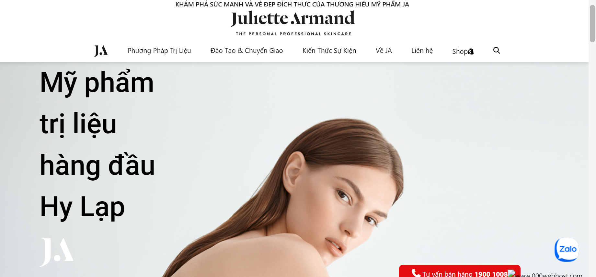
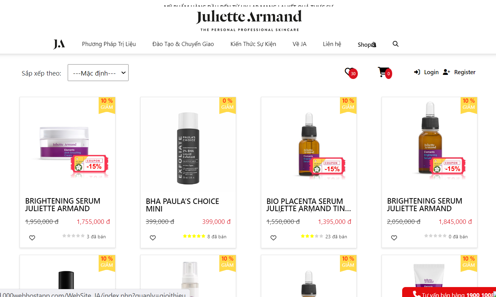
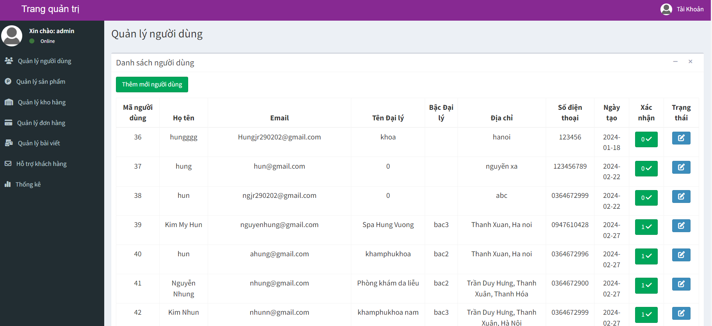

# Julietee Armand Website Design

In this project [Julietee Armand](https://juliettearmand.000webhostapp.com/WebSite_JA/index.php), I have created a website based on interviews about the process and operation of Julietee Armand cosmetic brand. This website helps the company to promote and sell products as well as approach more agents.

### Website designed:
* **FontEnd**: HTML, CSS and Less
* **BackEnd**: JavaScript and PHP

The project I developed based on my old project has developed on a [phone selling website](https://github.com/tuanthanh1011/PHP_Ecommerce_website.git)!

# Screenshot 
* **Main Screen**

* **Product Screen**

* **BackEnd Screen**

# How to operate 
### View Website
* Everyone
### Shopping
Only agents can be purchased and divided into 3 levels:
- Agents level 1 *(Buy the first product 50 million)*
- Agents level 2 *(Buy the first product 100 million)*
- Agents level 3 *(Buy the first product 200 million)*
### Management
* Admin

